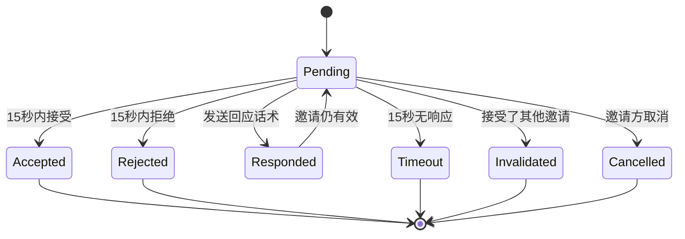
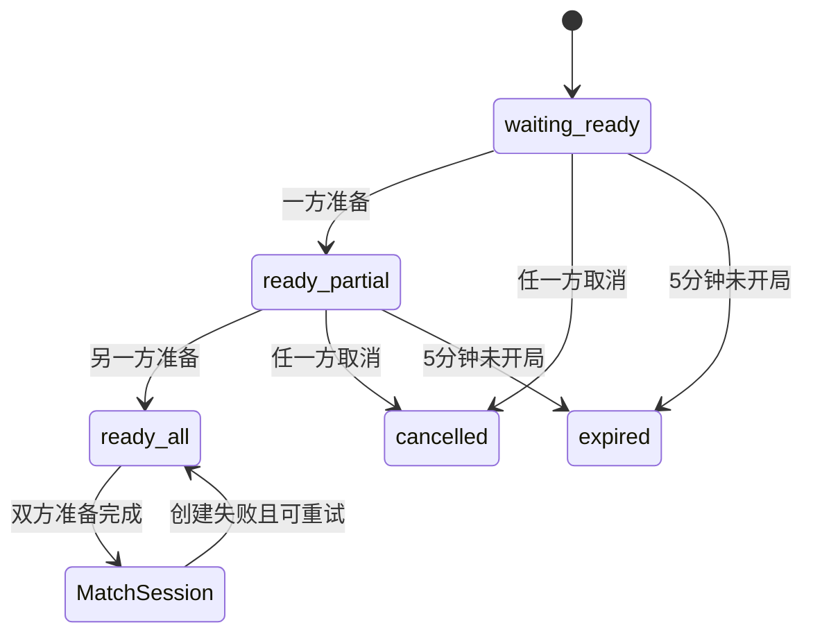

# 五子棋好友比拼完整交付回归评审

评审范围：Case D；只读审计。
权威基线：`scenario.json` 中 DEC-001～DEC-009、required_objects、required_routes、required_feature_ids。
结论：需求规则本身足以进入交接，但三类已返回产物均未通过返回审计，当前不能标记 `Completed` 或 `Handoff Ready`。

未修改、发布或推送任何外部产物。

## 1. 当前有效 DEC 决策快照

所有 DEC-001～DEC-009 均为 `Confirmed`，证据类型为：

- `Confirmed`：用户提供的权威场景数据；
- `Fact`：三份下游文件中的可观察内容；
- `Pending`：下游文档明确写出的 Needs Decision、未勾选项或未冻结契约；
- `Inference`：本次基于规则与产物差异做出的审计判断。

| 决策 | 当前有效规则 | 主要影响 |
|---|---|---|
| DEC-001 | 好友互通、添加好友、邀请组队、联机对弈、消息中心为首期主闭环 | F01～F09、六条核心路由 |
| DEC-002 | 在线通知、邀请回应话术、棋局预设文字与表情为 Must | F05、F09、消息与对局互动 |
| DEC-003 | 15 秒仅用于邀请响应；接受后进入独立组队准备阶段 | GameInvite、TeamSession |
| DEC-004 | 双方都准备后才能开局；组队 5 分钟未开局自动解散 | TeamSession、MatchSession |
| DEC-005 | 接受一个有效邀请后，其余邀请立即失效；邀请方看到“对方已进入对弈中” | 并发接受、消息反馈 |
| DEC-006 | 完全沿用现有真人对弈棋盘、胜负、投降、超时、异常退出、结算规则 | MatchSession |
| DEC-007 | 仅适配当前学习机横屏界面 | 全部页面与 UI 验收 |
| DEC-008 | 沿用既有五子棋暖色游戏化风格与资源 | 原型视觉边界 |
| DEC-009 | 人机入口合并、头像替换、勋章修复为独立同版本改动，不阻塞主闭环 | P101～P103 |

未发现本案新增的 `CHG`。下游文档中出现的以下规则不能升级为有效 DEC：

- 好友申请有效期 10 天、好友上限 100；
- 同一好友每日通知最多 3 次；
- 消息中心 100 条清理规则；
- Push 降级细节；
- 当前学习机具体分辨率、系统版本和性能基线。

其中前两项被开发和测试文档当作既定规则使用，但不在权威场景的 Confirmed DEC 中，应继续视为 `Pending`，不能作为已确认业务规则。

## 2. 自动触发状态机的原因

本案满足多个自动触发条件：

- 两名用户共同改变邀请、组队和对局对象；
- 异步通知、邀请回应和消息回调；
- 邀请 15 秒有效期；
- 组队 5 分钟自动解散；
- 并发接受、重复提交和幂等；
- 双方准备共同决定是否开局；
- 断网、熄屏、退出和恢复；
- 用户明确要求测试用例与状态机图。

因此不能只审查页面和按钮，必须审查业务对象、事件、守卫、失败出口、并发权威结果和测试覆盖。

### GameInvite



关键守卫：

- 只有有效 Pending 邀请可接受；
- 接受操作必须幂等；
- 并发接受只能产生一个权威成功结果；
- 其余邀请进入 `Invalidated`；
- 邀请方收到“对方已进入对弈中”。

### TeamSession



关键守卫：

- `ready_all` 之前不得创建棋局；
- 5 分钟倒计时从组队创建开始；
- 取消与超时后双方恢复空闲；
- 创建棋局必须幂等。

### MatchSession

权威场景要求沿用现有真人对弈规则。测试文档使用了 `Playing`、`Finished`、`Surrendered`、`Timeout`、`Disconnected`、`WaitingRematch`、`Closed` 等状态，覆盖方向正确，但对象名称错误：应使用 `MatchSession`，不能用 `GameSession` 替代权威对象名。

## 3. 邀请、组队、对局测试与追溯

| 领域 | 主要测试 | 覆盖决策 | 追溯评价 |
|---|---|---|---|
| 邀请创建与响应 | IN-001～IN-005 | DEC-002、DEC-003 | 覆盖 15 秒、拒绝、回应话术；基本完整 |
| 邀请并发与失效 | IN-006～IN-010 | DEC-003、DEC-005 | 覆盖单发、并发接受、幂等、取消和过期 |
| 全局邀请 | IN-011 | DEC-003 | 测试要求任意页面接收邀请，但原型只在首页弹出，存在产物偏差 |
| 组队准备 | TM-001～TM-005 | DEC-003、DEC-004 | 覆盖单方准备、双方准备、取消、5 分钟超时 |
| 创建棋局失败 | TM-006 | DEC-004、DEC-006 | 覆盖失败后保持准备完成并重试 |
| 组队并发 | TM-007 | DEC-004 | 覆盖取消与准备同时发生 |
| 对局规则 | GM-001～GM-003 | DEC-006 | 覆盖落子、投降、断网/熄屏、既有规则复用 |
| 对局互动 | GM-004～GM-006 | DEC-002、DEC-006 | 覆盖预设文字、表情、3 秒冷却和服务端拦截 |
| 再来一局 | GM-007～GM-010 | DEC-006 | 覆盖等待双方同意、先后手互换、退出反馈 |
| 消息中心 | MS-001～MS-007 | DEC-001、DEC-002 | 覆盖红点、已读、申请处理、过期和超时 |

主要追溯缺口：

1. 测试用例主要只回指 `F`，没有稳定回指 `DEC`、`TR`、`AC`。
2. 状态转移没有使用规定的 `TR-*` 编号。
3. `MatchSession` 被写成 `GameSession`，违反权威对象名称要求。
4. `MS-005` 依赖“冻结的清理规则”，但开发文档仍将其标为 `Needs Decision`，不能视为验收完成。
5. 测试中的 10 天、100 人、每日 3 次等规则未出现在权威 Confirmed DEC 中，责任应归下游需求契约/产品确认，不应由测试自行固化。

## 4. Handoff Manifest 与返回审计

### DEL-001：页面高保真原型

**Handoff Manifest**

- 来源基线：Case D；需求版本未在产物中声明；适配当前学习机横屏。
- 决策：DEC-001～DEC-009。
- 功能：F01～F09。
- 路由：`#/home`、`#/friends`、`#/add`、`#/messages`、`#/lobby`、`#/game`。
- 必须呈现：邀请 15 秒、独立组队准备、双方准备、5 分钟解散、消息中心、对局互动、异常状态。
- 禁止推断：不得自行新增业务规则、权限、真实服务能力或生产状态。
- 回传要求：页面入口、状态、Mock 边界、DEC/F/TR/AC/T/ART 追溯。

**返回审计**

产物路径：[Gomoku Friend Battle Prototype.html](/Users/tal/Documents/ChatGPT/新课件-0818/designs/gomoku-friend-battle/Gomoku%20Friend%20Battle%20Prototype.html)

已覆盖：

- 六条必需路由存在，见原型页面结构 [第 461–563 行](/Users/tal/Documents/ChatGPT/新课件-0818/designs/gomoku-friend-battle/Gomoku%20Friend%20Battle%20Prototype.html:461)；
- 15 秒邀请文案与组队准备文案存在 [第 529–537 行](/Users/tal/Documents/ChatGPT/新课件-0818/designs/gomoku-friend-battle/Gomoku%20Friend%20Battle%20Prototype.html:529)；
- 消息中心、好友、添加好友、预设文字、表情和投降入口存在；
- 横屏约束、焦点样式和 reduced-motion 样式存在。

关键偏差：

- 邀请流程在倒计时到 12 秒时自动调用 `acceptInvite()`，并非由对方真实接受 [第 721–727 行](/Users/tal/Documents/ChatGPT/新课件-0818/designs/gomoku-friend-battle/Gomoku%20Friend%20Battle%20Prototype.html:721)。
- 组队准备时自动把对方设置为已准备并跳转棋局，绕过双方共同准备守卫 [第 760–766 行](/Users/tal/Documents/ChatGPT/新课件-0818/designs/gomoku-friend-battle/Gomoku%20Friend%20Battle%20Prototype.html:760)。
- “5:00”仅为展示文本，没有实际 5 分钟倒计时或自动解散逻辑 [第 742–758 行](/Users/tal/Documents/ChatGPT/新课件-0818/designs/gomoku-friend-battle/Gomoku%20Friend%20Battle%20Prototype.html:742)。
- 全局邀请弹窗只在首页延迟触发，不能证明“任意页面接收邀请” [第 620–623、864–866 行](/Users/tal/Documents/ChatGPT/新课件-0818/designs/gomoku-friend-battle/Gomoku%20Friend%20Battle%20Prototype.html:620)。
- 再来一局直接创建新棋局，没有真实 `WaitingRematch` 状态 [第 835–854 行](/Users/tal/Documents/ChatGPT/新课件-0818/designs/gomoku-friend-battle/Gomoku%20Friend%20Battle%20Prototype.html:835)。
- 未出现 `FriendRelation`、`FriendRequest`、`GameInvite`、`TeamSession`、`MatchSession`、`MessageRecord` 等权威对象名，也没有 DEC/F/TR/AC/T/ART 追溯标识。
- 原型没有明确 Mock/真实能力边界。

**状态：Blocked**

文件可打开，但未通过状态行为、对象命名、异常出口和追溯审计。不能标记 `Completed`。

---

### DEL-002：研发任务拆分与验收清单

**Handoff Manifest**

- 来源基线：Case D；功能 F01～F09；DEC-001～DEC-009。
- 目标：研发任务、依赖、AC、发布风险和非阻塞独立项。
- 必须覆盖：六个权威对象、状态、并发、幂等、超时、失败恢复、横屏适配。
- 禁止推断：未确认的好友申请期限、清理规则、Push 降级、性能基线不得写成已确认。
- 回传要求：每个 Must 对应任务、Owner、依赖、AC、测试和 ART-ID。

**返回审计**

产物路径：[Development Tasks and Acceptance Checklist.md](/Users/tal/Documents/ChatGPT/新课件-0818/designs/gomoku-friend-battle/Development%20Tasks%20and%20Acceptance%20Checklist.md)

已覆盖：

- F01～F09 功能矩阵 [第 18–30 行](/Users/tal/Documents/ChatGPT/新课件-0818/designs/gomoku-friend-battle/Development%20Tasks%20and%20Acceptance%20Checklist.md:18)；
- 依赖、前端、后端、数据和发布任务；
- 邀请、组队、并发、幂等、异常和横屏验收方向；
- 六条必需路由；
- P101～P103 独立改动不阻塞主闭环。

关键偏差：

- 文件自身声明交付状态为 `Needs Decision` [第 3–6 行](/Users/tal/Documents/ChatGPT/新课件-0818/designs/gomoku-friend-battle/Development%20Tasks%20and%20Acceptance%20Checklist.md:3)。
- 多个外部依赖与核心任务仍为 `Needs Decision`，包括统一好友服务、在线状态、Push、消息契约和同步时效 [第 40–47、62–70 行](/Users/tal/Documents/ChatGPT/新课件-0818/designs/gomoku-friend-battle/Development%20Tasks%20and%20Acceptance%20Checklist.md:40)。
- Ready 检查有 5 项未勾选 [第 129–140 行](/Users/tal/Documents/ChatGPT/新课件-0818/designs/gomoku-friend-battle/Development%20Tasks%20and%20Acceptance%20Checklist.md:129)。
- Done 检查全部未勾选 [第 164–171 行](/Users/tal/Documents/ChatGPT/新课件-0818/designs/gomoku-friend-battle/Development%20Tasks%20and%20Acceptance%20Checklist.md:164)。
- required object 中的 `MatchSession` 被替换成 `GameSession`；`FriendRelation` 未列出。
- 10 天、100 人、每日 3 次、消息 100 条等规则混入任务与验收，但没有对应 Confirmed DEC。
- 没有 `DEL`、`ART` 或完整 `DEC/F/TR/AC/T` 追溯表。

**状态：Blocked**

该文档可作为研发草案，不能作为 Ready 的生产研发交接包。

---

### DEL-003：测试用例与状态机图

**Handoff Manifest**

- 来源基线：Case D；DEC-001～DEC-009；F01～F09。
- 目标：状态机、正向测试、守卫拒绝、恢复/终态、并发、幂等、故障注入。
- 必须覆盖：GameInvite、TeamSession、MatchSession、好友关系、好友申请、消息记录。
- 验证要求：每个 Must 转移至少有正向、拒绝、恢复或终态测试；必须回指 DEC/F/TR/AC。
- 禁止推断：未确认规则不能升级为已验收。
- 回传要求：测试 ID、转移 ID、决策、功能、AC、ART 和实际执行证据。

**返回审计**

产物路径：[Test Cases and State Machines.md](/Users/tal/Documents/ChatGPT/新课件-0818/designs/gomoku-friend-battle/Test%20Cases%20and%20State%20Machines.md)

已覆盖：

- 好友申请、邀请、组队、对局/再来一局四类状态机；
- 邀请 15 秒、组队 5 分钟、并发接受、重复回调、创建失败和弱网；
- IN-001～IN-011 邀请测试；
- TM-001～TM-007 组队测试；
- GM-001～GM-010 对局测试；
- 消息中心和 UI 状态测试。

关键偏差：

- 状态转移没有 `TR-*` 稳定编号；
- 用例追溯大多只有 F01～F09，没有 DEC、TR、AC；
- `MatchSession` 被命名为 `GameSession`；
- `IN-011` 要求任意页面全局邀请，但原型不满足；
- `MS-005` 依赖仍未冻结的消息清理规则；
- 测试文档中部分新增规则没有权威 DEC；
- 文档是测试设计资产，不包含实际执行结果，不能据此宣布 P0 已通过。

**状态：Blocked**

测试资产覆盖面较好，但因追溯、对象命名、未决规则和缺少执行证据，不能标记 `Completed`。

## 5. 下游产物 Ready/Blocked 判定

| Delivery ID | 产物 | 证据 | 判定 |
|---|---|---|---|
| DEL-001 | 高保真页面原型 | 文件存在，主页面可观察；关键状态行为被演示逻辑绕过 | **Blocked** |
| DEL-002 | 研发任务与验收清单 | 功能和任务结构完整，但自身为 Needs Decision，多个门槛未勾选 | **Blocked** |
| DEL-003 | 测试用例与状态机图 | 状态和测试覆盖较完整，但缺少正式追溯与执行证据 | **Blocked** |

因此当前总体交付状态为：

```text
需求基线：Ready
状态建模：Ready for Specification
下游返回审计：Blocked
生产交接：Blocked
Validation Passed：不可声明
v1.0：不可声明
```

## 6. Skill 本次运行表现四维评分

此评分只评价 Skill 的引导、建模、穿透和约束能力，不把下游产物自身缺陷反向计入 Skill 扣分。

| 维度 | 得分 | 评价 |
|---|---:|---|
| 引导深度 | 24/25 | 能识别已确认场景，不重复提问；要求从目标、决策和阶段门槛推进 |
| 架构完备性 | 25/25 | 明确单一事实源、对象优先、状态机自动触发、Must 追溯链和异常分支 |
| 设计穿透力 | 23/25 | 明确要求页面状态、Mock/真实边界、关键异常和交接回传；本次审计能穿透到原型行为而非只看页面存在 |
| 抗幻觉与约束 | 25/25 | 严格区分 Confirmed/Pending/Fact；不把文件存在、未勾选项或测试设计当作完成；明确只读边界 |

**总分：97/100，Skill 本次运行表现为通过。**

## 最终结论

需求确认基线有效，状态机自动触发判断正确，邀请、组队和对局的核心测试方向基本齐全。但原型存在自动接受、自动准备、缺少实际组队超时和直接创建再来一局等关键行为偏差；研发与测试产物仍含未决规则、对象命名偏差、追溯缺失和未执行证据。

因此三类下游产物均为 `Blocked`，不能宣称已完成生产交接。
