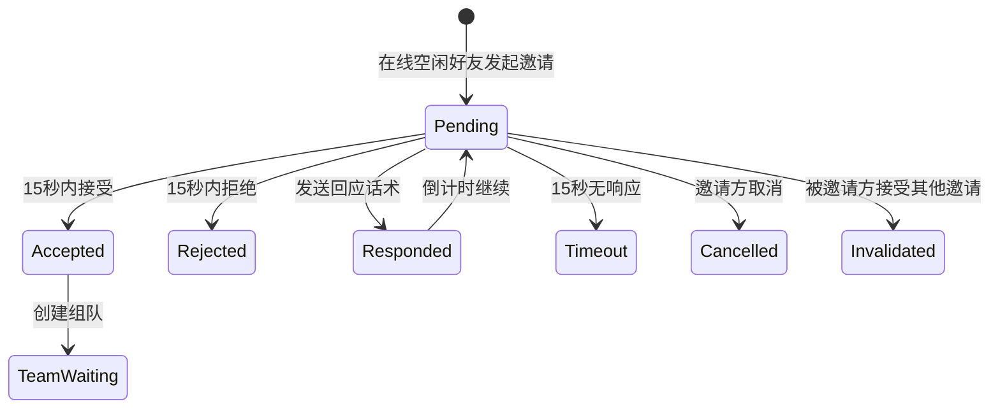
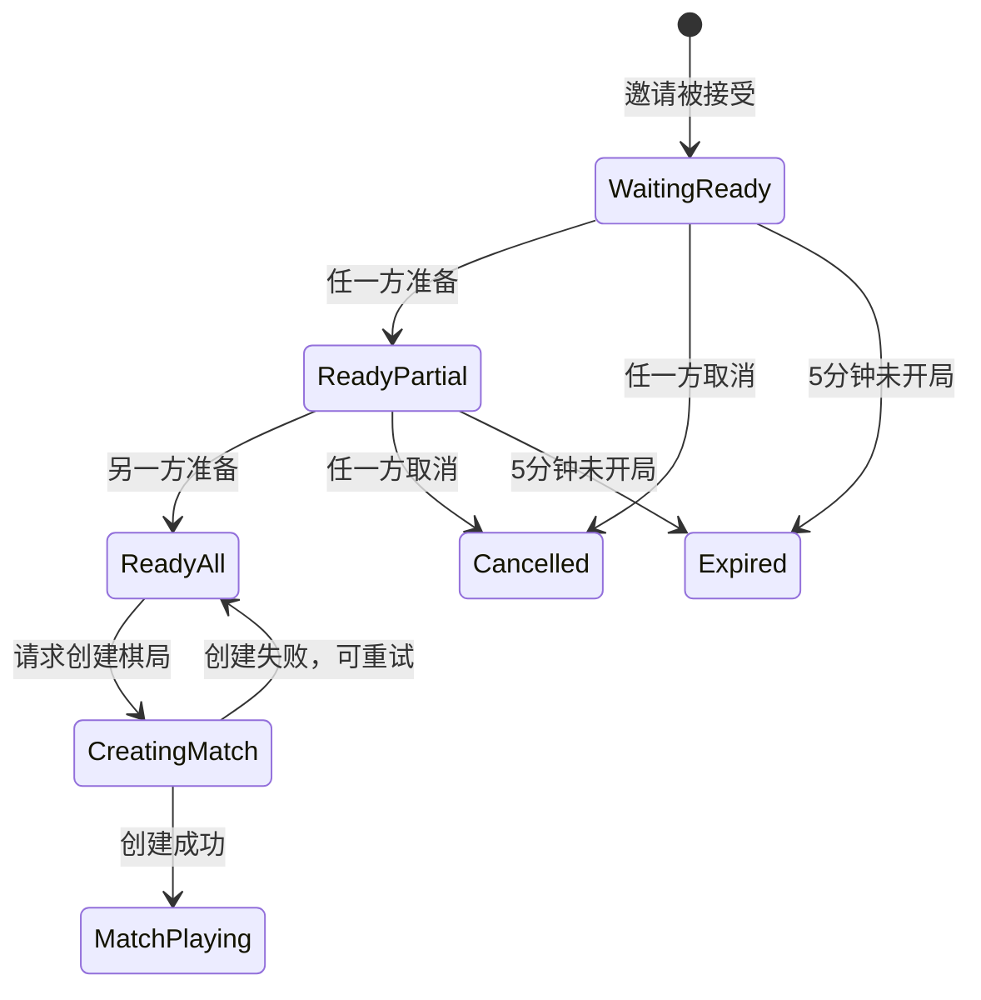
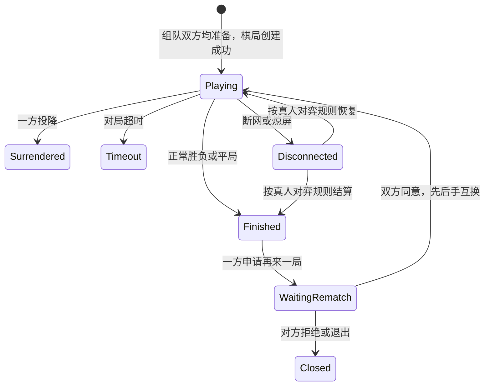

# 五子棋好友比拼完整交付回归评审

结论：需求基线本身已具备跨 Skill 交接条件，但三份下游产物均不能判定为 Completed。核心原因是原型存在模拟流程与业务规则不一致，研发文档保留高影响 Needs Decision，测试文档虽覆盖较全但尚无通过证据，且 `MatchSession` 被写成了 `GameSession`。

评审范围：

- 权威场景：[scenario.json](/Users/tal/.codex/skills/product-architecture-requirements/tests/gomoku-case-d/scenario.json)
- 原型：[Gomoku Friend Battle Prototype.html](/Users/tal/Documents/ChatGPT/新课件-0818/designs/gomoku-friend-battle/Gomoku%20Friend%20Battle%20Prototype.html)
- 研发：[Development Tasks and Acceptance Checklist.md](/Users/tal/Documents/ChatGPT/新课件-0818/designs/gomoku-friend-battle/Development%20Tasks%20and%20Acceptance%20Checklist.md)
- 测试：[Test Cases and State Machines.md](/Users/tal/Documents/ChatGPT/新课件-0818/designs/gomoku-friend-battle/Test%20Cases%20and%20State%20Machines.md)

## 1. 当前有效 DEC 决策快照

以下 9 条均来自权威场景数据，证据类型为“用户确认 / 权威场景数据”，状态为 Confirmed。

| DEC | 当前有效规则 | 主要影响 |
|---|---|---|
| DEC-001 | 首期闭环为好友互通、添加好友、邀请组队、联机对弈、消息中心 | F01–F08、核心页面 |
| DEC-002 | 在线通知、邀请回应话术、棋局预设文字与表情为 Must | F05、F09、消息/对局交互 |
| DEC-003 | 15 秒只限制邀请响应；接受后进入独立组队准备阶段 | GameInvite、TeamSession、F06/F07 |
| DEC-004 | 双方都准备后才开局；组队 5 分钟未开局自动解散 | TeamSession、F07 |
| DEC-005 | 接受一个有效邀请后，其余邀请立即失效；邀请方看到“对方已进入对弈中” | 并发邀请、GameInvite、F06/F07 |
| DEC-006 | 好友对弈沿用真人对弈的棋盘、胜负、投降、超时、异常退出和结算规则 | MatchSession、F08 |
| DEC-007 | 首期只适配当前学习机横屏界面 | 页面布局、触控、焦点 |
| DEC-008 | 沿用现有五子棋暖色游戏化风格和资源 | 原型视觉边界 |
| DEC-009 | 人机入口合并、头像替换、勋章修复为同版本独立改动，不阻塞主闭环 | P101–P103、独立回归 |

决策快照与下游产物之间未发现 DEC 被静默改写，但存在以下传播缺口：

- `DEC-004` 未完整传播到原型：原型没有真实的 5 分钟组队倒计时和自动解散行为。
- `DEC-005` 未完整传播到原型：没有多邀请并发、其余邀请失效和邀请方提示的可操作实现。
- `DEC-006` 产生对象命名偏差：场景要求 `MatchSession`，研发和测试文档使用 `GameSession`。
- `DEC-007` 仍被研发文档标记为部分待确认：目标分辨率、系统版本和性能基线未冻结。
- `DEC-009` 中 `P103` 在研发文档有列出，但原型追溯只明确了 P101、P102，未形成完整独立项证据。

## 2. 自动触发状态机的原因

本项目命中以下自动触发条件：

- 两名用户共同改变邀请、组队和棋局对象；
- 异步通知、消息记录和在线状态同步；
- 邀请 15 秒、组队 5 分钟、好友申请 10 天、通知每日限频；
- 并发接受、重复提交、抢占和幂等；
- 取消、拒绝、超时、自动失效；
- 断网、熄屏、异常退出与恢复；
- 用户明确要求测试用例与状态机图。

### GameInvite 关键转移

关键守卫：

- 邀请双方必须为好友；
- 被邀请方必须在线且空闲；
- 同一邀请只能成功处理一次；
- 接受一个有效邀请后，其余有效邀请立即 `Invalidated`；
- `Timeout`、`Rejected`、`Cancelled`、`Invalidated` 不得再次接受。

### TeamSession 关键转移

关键守卫：

- `ReadyAll` 之前不得创建棋局；
- 组队从创建起最多保留 5 分钟；
- 取消或超时后双方恢复空闲；
- 同一组队最多对应一个有效棋局；
- 创建失败不能重复创建组队。

### MatchSession 关键转移

测试文档中的状态图覆盖了同样的行为，但对象名为 `GameSession`，需由研发和测试责任人统一回写为权威对象 `MatchSession`，或建立明确别名映射。

## 3. 邀请、组队、对局测试与追溯

| 领域 | 测试覆盖 | 对应功能 | 对应决策 | 评审结论 |
|---|---|---|---|---|
| 邀请创建与倒计时 | IN-001、IN-003、IN-006 | F06 | DEC-003 | 有正向、超时、单发限制；需补真实服务端时间证据 |
| 邀请接受与组队 | IN-002、TM-001、TM-002 | F06/F07 | DEC-003/004 | 逻辑覆盖完整 |
| 多邀请并发 | IN-007、IN-008 | F06/F07 | DEC-005 | 测试有覆盖；原型未实现 |
| 邀请回应话术 | IN-005 | F06/F09 | DEC-002/003 | 测试覆盖；原型有话术入口，但没有真实回传状态 |
| 组队超时 | TM-003、TM-004 | F07 | DEC-004 | 测试覆盖 4:59、5:00；原型只展示 `5:00`，没有倒计时和自动解散 |
| 取消与恢复 | TM-005、TM-007 | F07 | DEC-004/005 | 有取消和并发测试 |
| 棋局创建失败 | TM-006、NF-004 | F07/F08 | DEC-004/006 | 有停留、重试和幂等要求 |
| 真人对弈规则 | GM-001、GM-002、GM-003 | F08 | DEC-006 | 测试覆盖落子、投降、断网、熄屏；原型实际使用本地模拟落子 |
| 棋局互动 | GM-004、GM-005、GM-006 | F09 | DEC-002/006 | 有客户端与服务端限频测试 |
| 再来一局 | GM-007、GM-008、GM-009 | F08 | DEC-006 | 有等待、同意、退出和换先后手测试 |
| 消息中心 | MS-001–MS-007 | F02/F03/F06 | DEC-001/002/005 | 覆盖红点、已读、可操作和超时；100 条清理规则仍待确认 |
| 页面状态 | UI-001–UI-009 | F01–F09 | DEC-007/008 | 有 loading、empty、error、无权限和 reduced-motion 测试 |

### F01–F09 总体追溯

| 功能 | 研发追溯 | 测试追溯 | 原型入口 | 结论 |
|---|---|---|---|---|
| F01 好友互通 | FE-03、BE-01/02 | FR-001、FR-011/012 | `#/friends`、`#/add` | 有追溯；跨产品契约仍 Blocked |
| F02 添加好友 | FE-03、BE-02 | FR-002–010、MS-003/004 | `#/add`、`#/messages` | 覆盖较完整；原型仅为本地 Mock |
| F03 消息中心 | FE-04、BE-06 | MS-001–007 | `#/messages` | 有追溯；清理规则未冻结 |
| F04 好友列表 | FE-02、BE-05 | FL-001–003、FL-007、GM-010 | `#/friends` | 有追溯；在线状态契约未冻结 |
| F05 通知上线 | FE-02、BE-07 | FL-003–006、NF-005 | `#/friends` | 有入口；Push 失败和限频契约未完成 |
| F06 邀请比拼 | FE-01、FE-05、BE-03 | IN-001–011 | `#/home`、`#/friends`、`#/lobby` | 主链路有追溯；原型并发规则不完整 |
| F07 组队准备 | FE-06、BE-04 | TM-001–007 | `#/lobby` | 测试充分；原型缺少真实 5 分钟状态 |
| F08 好友对弈 | FE-07/08、BE-08 | GM-001–003、GM-007–010 | `#/game` | 规则复用有声明；原型不是联机 MatchSession |
| F09 棋局互动 | FE-07、BE-09 | IN-005、GM-004–006 | `#/game` | 有交互和限频；原型未证明对端投递和记录一致 |

## 4. 三类 Handoff Manifest 与返回审计

以下为本次只读评审重建的审计 Manifest。原始文件中没有独立 Manifest 文件，因此状态以本次返回审计为准。

### DEL-001：高保真原型

| 字段 | 审计内容 |
|---|---|
| 目标产物 | `Gomoku Friend Battle Prototype.html` |
| 来源基线 | 场景 D、DEC-001–009、F01–F09、六条必需路由 |
| 页面范围 | `#/home`、`#/friends`、`#/add`、`#/messages`、`#/lobby`、`#/game` |
| 已确认约束 | 当前学习机横屏、沿用暖色游戏化风格、15 秒邀请、5 分钟组队 |
| 返回证据 | 页面路由、好友/添加/消息/组队/棋局界面；包含回应话术、表情、倒计时文案和 reduced-motion CSS |
| 主要偏差 | 12 秒自动接受；双方准备后 1.2 秒自动完成；组队 5 分钟没有真实计时器；棋局为本地自动落子模拟；无多邀请失效闭环 |
| 状态 | **Blocked** |
| 责任 | 原型交付责任人；需按 DEC-003/004/005/006 重做状态行为并补验证证据 |

关键证据见原型中的 `startInvite`、`acceptInvite`、`readyUp`、`acceptIncoming` 和 `placeStone` 逻辑：[原型相关行](/Users/tal/Documents/ChatGPT/新课件-0818/designs/gomoku-friend-battle/Gomoku%20Friend%20Battle%20Prototype.html:716)。

### DEL-002：研发任务与验收清单

| 字段 | 审计内容 |
|---|---|
| 目标产物 | `Development Tasks and Acceptance Checklist.md` |
| 来源基线 | F01–F09、必需对象、DEC-001–009 |
| 返回证据 | 功能矩阵、对象不变量、FE/BE 任务、接口级输入输出、Ready/Done 清单、页面追溯 |
| 已覆盖 | F01–F09 均有研发任务；邀请并发、组队幂等、消息、Push、真人对弈复用均被列出 |
| 阻塞项 | D01、D02、D04、API-01–03、FE-04、FE-10、BE-01、BE-05–07、DATA/OPS 多项仍为 Needs Decision |
| 对象偏差 | 使用 `GameSession`，未使用场景要求的 `MatchSession` |
| 状态 | **Blocked** |
| 责任 | 产品负责人及统一好友、在线状态、Push、游戏服务负责人；需关闭高影响契约后再进入研发 Ready |

文档自身明确写有“交付状态：Needs Decision”，且 Ready/Done 清单仍有未勾选项：[研发清单](/Users/tal/Documents/ChatGPT/新课件-0818/designs/gomoku-friend-battle/Development%20Tasks%20and%20Acceptance%20Checklist.md:5)、[Ready 检查](/Users/tal/Documents/ChatGPT/新课件-0818/designs/gomoku-friend-battle/Development%20Tasks%20and%20Acceptance%20Checklist.md:129)。

### DEL-003：测试用例与状态机

| 字段 | 审计内容 |
|---|---|
| 目标产物 | `Test Cases and State Machines.md` |
| 来源基线 | F01–F09、六个业务对象、DEC-001–009 |
| 返回证据 | FriendRequest、邀请、组队、棋局四类状态机；FR/FL/IN/TM/GM/MS/UI/NF 用例 |
| 已覆盖 | 正向、拒绝、超时、并发、幂等、断网、Push 失败、弱网、回滚和无障碍 |
| 主要偏差 | `GameSession` 与 `MatchSession` 命名不一致；没有实际执行结果、通过证据或缺陷回写 |
| 重要限制 | 文档写明 P0 全部通过是发布门槛，但没有说明本次已通过 |
| 状态 | **Blocked** |
| 责任 | 测试负责人和产品负责人；需统一对象命名、执行 P0 用例并附结果、环境、清理和缺陷证据 |

测试文档覆盖情况见：[邀请用例](/Users/tal/Documents/ChatGPT/新课件-0818/designs/gomoku-friend-battle/Test%20Cases%20and%20State%20Machines.md:158)、[组队用例](/Users/tal/Documents/ChatGPT/新课件-0818/designs/gomoku-friend-battle/Test%20Cases%20and%20State%20Machines.md:174)、[对局用例](/Users/tal/Documents/ChatGPT/新课件-0818/designs/gomoku-friend-battle/Test%20Cases%20and%20State%20Machines.md:188)。

## 5. 关键返回审计结论

### 已通过的审计项

- 六条必需路由均存在。
- F01–F09 在研发清单、测试文档和原型路由之间基本建立了双向追溯。
- 15 秒邀请响应与 5 分钟组队准备在研发和测试文档中被区分。
- 测试文档覆盖了邀请、组队、对局、并发、超时、重试和异常退出。
- 原型继承了暖色游戏化风格，并提供横屏布局、焦点样式和 reduced-motion 规则。
- 文档没有把未勾选验收项直接宣称为已完成。

### 必须阻塞的缺口

1. 原型中的“自动接受”和“自动准备”是演示脚本行为，不是 DEC-003/004 的真实交互验证。
2. 原型没有实现 DEC-005 的多邀请并发失效与邀请方反馈。
3. 原型没有实现 TeamSession 的 5 分钟倒计时、超时终态和双方恢复空闲。
4. 原型棋盘由本地脚本自动落子，不能证明 MatchSession 的联机对弈、断线恢复和双方一致性。
5. `MatchSession` / `GameSession` 对象命名不一致，影响研发、测试和数据追溯。
6. 研发文档中的高影响外部契约尚未关闭。
7. 测试文档没有真实执行结果，不能把测试用例存在等同于测试通过。
8. 当前学习机目标分辨率、系统版本、性能基线仍未确认，不能宣布视觉交接完成。

## 6. Skill 本次运行表现四维评分

评分只评价 Skill 是否正确引导、建模、穿透和约束，不把下游产物缺陷反向算作 Skill 扣分。

| 维度 | 得分 | 证据 |
|---|---:|---|
| 引导深度 | 24/25 | 接受已确认场景，不重复提问；按用户要求直接进入正式回归；区分权威输入、产物证据和审计结论 |
| 架构完备性 | 25/25 | 识别六类对象、F01–F09、DEC 传播、并发/超时/幂等和 Ready 门槛；对对象命名偏差进行了定位 |
| 设计穿透力 | 24/25 | 审计了路由、组件状态、倒计时、弹窗、焦点、reduced-motion 与原型脚本行为；明确原型行为不等于联机业务证据 |
| 抗幻觉与约束 | 25/25 | 未把 Needs Decision、未勾选项或测试用例说成已验收；未输出实现代码；保持只读边界并区分责任 |
| **总分** | **98/100** | 达到 Skill 发布候选门槛；本次下游产物仍被独立判定为 Blocked |

## 7. 下游产物 Ready/Blocked 判定

| 交付物 | 判定 | 原因 |
|---|---|---|
| DEL-001 高保真原型 | **Blocked** | 关键状态被自动模拟，缺少 5 分钟超时、多邀请失效和真实联机对局证据 |
| DEL-002 研发任务拆分 | **Blocked** | 多项高影响依赖仍为 Needs Decision，且 `MatchSession` 对象未对齐 |
| DEL-003 测试用例与状态机 | **Blocked** | 用例和状态图覆盖较完整，但没有执行结果；对象命名存在偏差 |
| 需求基线 | **Ready** | 权威 DEC、功能范围、页面路由和核心状态规则已具备；下游契约仍需按责任人关闭 |
| 发布/Done | **Blocked** | 没有 P0 通过证据，且原型与研发交接仍存在阻塞项 |

本次为只读正式回归评审，未修改、发布或推送任何外部产物。